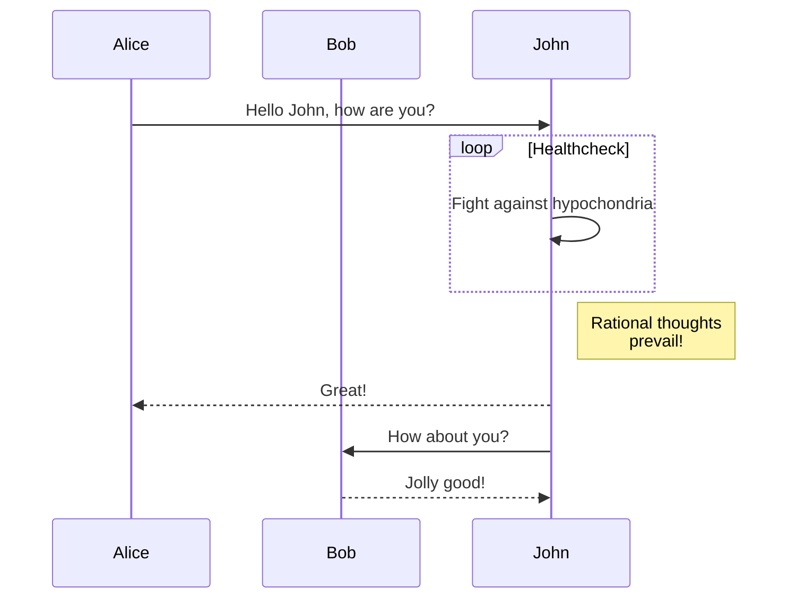

+++
title = "الاختصارات"
description = "اختصارات قالب لينكيتا."
date = 2022-10-20
updated = 2025-04-20
[taxonomies]
tags = ["markdown", "css", "html"]
authors = ["kita", "salif"]
[extra]
mermaid = true
+++

يوفر قالب لينكيتا العديد من الاختصارات.

لم تسمع عن الاختصارات من قبل؟ راجع [توثيق Zola](https://www.getzola.org/documentation/content/shortcodes/) لمزيد من المعلومات.

## Mermaid {#mermaid-header}

لاستخدام Mermaid في صفحتك، يجب عليك ضبط `extra.mermaid = true` في مقدمة الصفحة.

```toml
+++
title = "عنوان صفحتك"

[extra]
mermaid = true
+++
```

ثم يمكنك استخدام اختصار `mermaid()` مثل:

```markdown


graph TD;
A-->B;
A-->C;
B-->D;
C-->D;


```

سيتم عرض هذا على النحو التالي:



graph TD;
A-->B;
A-->C;
B-->D;
C-->D;



بالإضافة إلى ذلك، يمكنك استخدام كتلة التعليمات البرمجية داخل اختصار `mermaid()` وسيتم تجاهل كتلة التعليمات البرمجية.

تمنع كتلة التعليمات البرمجية المنسق من كسر تنسيق Mermaid.

````markdown





````

سيتم عرض هذا على النحو التالي:






## التنبيهات

يعرض اختصار `admonition()` لافتة لمساعدتك في وضع ملاحظة في صفحتك.

يمكنك استخدام اختصار `admonition()` مثل:

```markdown

تنبيه `tip`.

```

يحتوي اختصار التنبيه على 12 نوعًا مختلفًا:


تنبيه `note`.



تنبيه `abstract`.



تنبيه `info`.



تنبيه `tip`.



تنبيه `success`.



تنبيه `question`.



تنبيه `warning`.



تنبيه `failure`.



تنبيه `danger`.



تنبيه `bug`.



تنبيه `example`.



تنبيه `quote`.


## معرض الصور

اختصار `gallery()` هو معرض صور بسيط قابل للنقر يعتمد على HTML فقط ويعرض جميع الصور من أصول الصفحة.

إنه من [توثيق Zola](https://www.getzola.org/documentation/content/image-processing/)

```markdown
{{/* gallery() */}}
```

{{ gallery(alt="صورة تجريبية لمعرض الصور") }}

## المشاريع

يتيح لك الكود المختصر `projects()` إنشاء صفحة لمشاريعك.

أنشئ ملفًا باسم `content/pages/projects/index.md`:

```markdown
+++
title = "مشاريعي"
description = ""
path = "projects"
+++

{{/* projects(path="data.toml", format="toml") */}}
```

أنشئ ملفًا باسم `content/pages/projects/data.toml`:

```toml
[[project]]
name = "lorem"
desc = "Lorem ipsum dolor sit."
tags = ["lorem", "ipsum"]
links = [
    { name = "homepage", url = "https://example.com" },
    { name = "source", url = "https://example.com" },
]
```

سيتم عرض هذا كالتالي:

{{ projects(path="projects.toml", format="toml") }}
