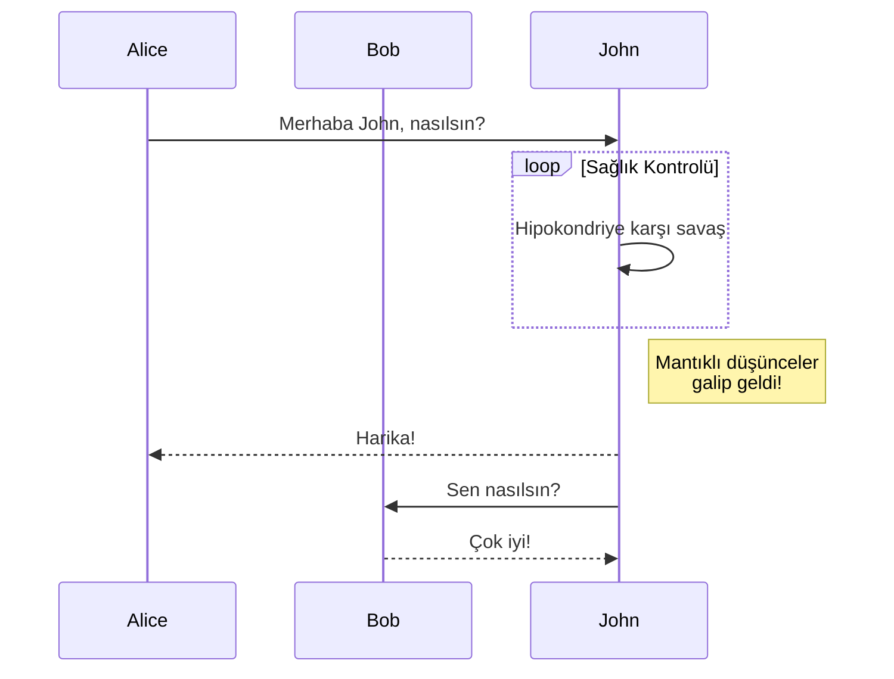

+++
title = "Kısa Kodlar"
description = "Linkita temasının kısa kodları."
date = 2022-10-20
updated = 2025-04-20
[taxonomies]
tags = ["markdown", "css", "html"]
authors = ["kita", "salif"]
[extra]
mermaid = true
+++

Linkita teması çeşitli kısa kodlar sunar.

Kısa kodları hiç duymadınız mı? Daha fazla bilgi için [Zola dokümantasyonuna](https://www.getzola.org/documentation/content/shortcodes/) bakın.

## Mermaid {#mermaid-header}

Sayfanızda Mermaid kullanmak için, sayfanın ön yüzünde `extra.mermaid = true` olarak ayarlamanız gerekir.

```toml
+++
title = "Sayfa başlığınız"

[extra]
mermaid = true
+++
```

Ardından `mermaid()` kısa kodlarını şu şekilde kullanabilirsiniz:

```markdown


graph TD;
A-->B;
A-->C;
B-->D;
C-->D;


```

Bu şu şekilde görüntülenecektir:



graph TD;
A-->B;
A-->C;
B-->D;
C-->D;



Ek olarak, `mermaid()` kısa kodlarının içinde kod bloğu kullanabilirsiniz ve kod bloğu göz ardı edilecektir.

Kod bloğu, biçimlendiricinin mermaid'in biçimlendirmesini bozmasını engeller.

````markdown





````

Bu şu şekilde görüntülenecektir:






## Uyarı Kutuları

`admonition()` kısa kodu, sayfanıza dikkat çekici notlar yerleştirmenize yardımcı olacak bir başlık görüntüler.

`admonition()` kısa kodunu şu şekilde kullanabilirsiniz:

```markdown

`ipucu` uyarı kutusu.

```

Uyarı kutusu kısa kodunun 12 farklı türü vardır:


`not` uyarı kutusu.



`özet` uyarı kutusu.



`bilgi` uyarı kutusu.



`ipucu` uyarı kutusu.



`başarılı` uyarı kutusu.



`soru` uyarı kutusu.



`uyarı` uyarı kutusu.



`başarısızlık` uyarı kutusu.



`tehlike` uyarı kutusu.



`hata` uyarı kutusu.



`örnek` uyarı kutusu.



`alıntı` uyarı kutusu.


## Galeri

`gallery()` kısa kodu, sayfa varlıklarındaki tüm resimleri görüntüleyen çok basit, yalnızca HTML tabanlı tıklanabilir bir resim galerisidir.

[Zola dokümantasyonundan](https://www.getzola.org/documentation/content/image-processing/) alınmıştır.

```markdown
{{/* gallery() */}}
```

{{ gallery(alt="Galeri için demo resim") }}

## Projeler

`projects()` kısa kodu, projeleriniz için bir sayfa oluşturmanıza olanak tanır.

Bir `content/pages/projects/index.md` dosyası oluşturun:

```markdown
+++
title = "Projelerim"
description = ""
path = "projects"
+++

{{/* projects(path="data.toml", format="toml") */}}
```

Bir `content/pages/projects/data.toml` dosyası oluşturun:

```toml
[[project]]
name = "lorem"
desc = "Lorem ipsum dolor sit."
tags = ["lorem", "ipsum"]
links = [
    { name = "homepage", url = "https://example.com" },
    { name = "source", url = "https://example.com" },
]
```

Bu şu şekilde görüntülenecektir:

{{ projects(path="projects.toml", format="toml") }}
