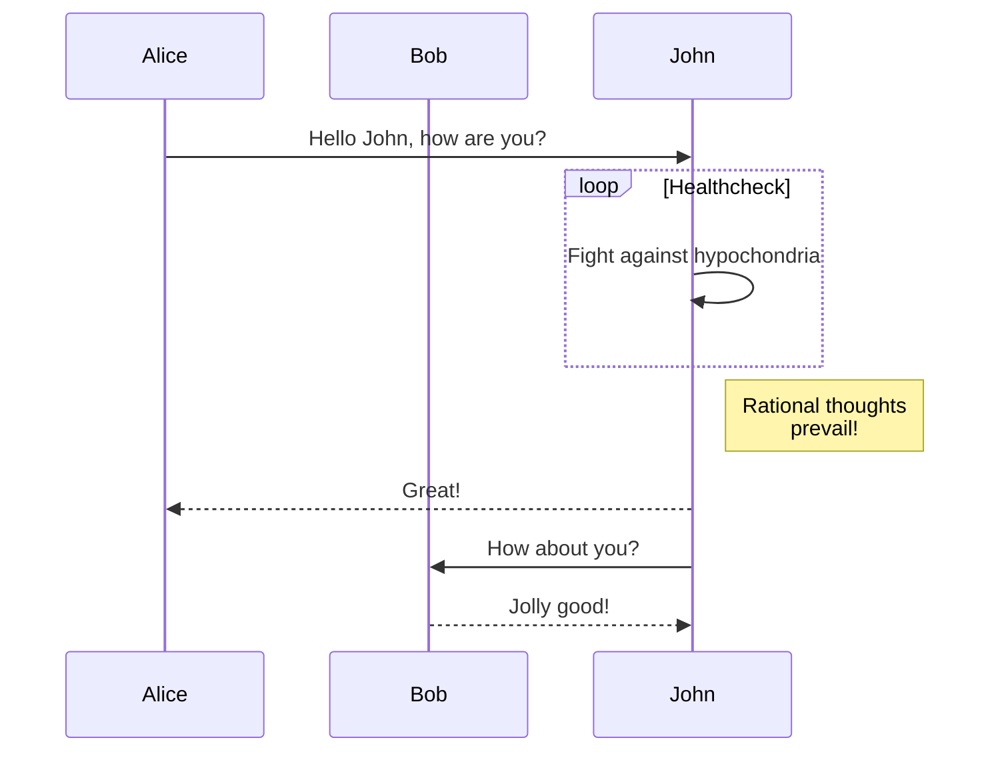

+++
title = "简码"
description = "林基塔主题的简码。"
date = 2022-10-20
updated = 2025-04-20
[taxonomies]
tags = ["markdown", "css", "html"]
authors = ["kita", "salif"]
[extra]
mermaid = true
+++

林基塔主题提供了多种简码。

没听说过简码？请参阅 [Zola 文档](https://www.getzola.org/documentation/content/shortcodes/) 获取更多信息。

## Mermaid {#mermaid-header}

要在页面中使用 Mermaid，您需要在页面的 frontmatter 中设置 `extra.mermaid = true`。

```toml
+++
title = "您的页面标题"

[extra]
mermaid = true
+++
```

然后您可以使用 `mermaid()` 简码，例如：

```markdown


graph TD;
A-->B;
A-->C;
B-->D;
C-->D;


```

这将被渲染为：



graph TD;
A-->B;
A-->C;
B-->D;
C-->D;



此外，您可以在 `mermaid()` 简码内使用代码块，代码块将被忽略。

代码块可以防止格式化程序破坏 mermaid 的格式。

````markdown





````

这将被渲染为：






## 提示框

`admonition()` 简码显示一个横幅，帮助您在页面中放置提示。

您可以像这样使用 `admonition()` 简码：

```markdown

`tip` 提示框。

```

提示框简码有 12 种不同的类型：


`note` 提示框。



`abstract` 提示框。



`info` 提示框。



`tip` 提示框。



`success` 提示框。



`question` 提示框。



`warning` 提示框。



`failure` 提示框。



`danger` 提示框。



`bug` 提示框。



`example` 提示框。



`quote` 提示框。


## 画廊

`gallery()` 简码是一个非常简单的纯 HTML 可点击图片画廊，用于显示页面资源中的所有图像。

它来自 [Zola 文档](https://www.getzola.org/documentation/content/image-processing/)

```markdown
{{/* gallery() */}}
```

{{ gallery(alt="画廊的演示图片") }}

## 项目

`projects()` 短代码允许您为您的项目创建一个页面。

创建一个 `content/pages/projects/index.md` 文件：

```markdown
+++
title = "我的项目"
description = ""
path = "projects"
+++

{{/* projects(path="data.toml", format="toml") */}}
```

创建一个 `content/pages/projects/data.toml` 文件：

```toml
[[project]]
name = "lorem"
desc = "Lorem ipsum dolor sit."
tags = ["lorem", "ipsum"]
links = [
    { name = "homepage", url = "https://example.com" },
    { name = "source", url = "https://example.com" },
]
```

这将显示为：

{{ projects(path="projects.toml", format="toml") }}
